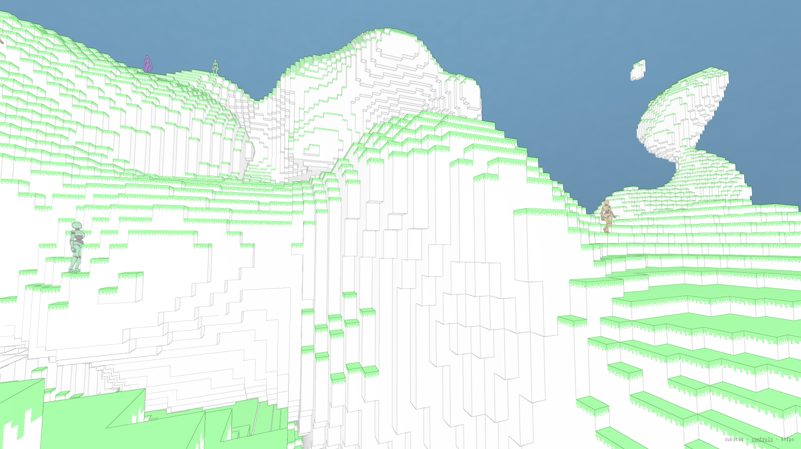

[cubitos](https://github.com/danielesteban/cubitos/)
[](https://www.npmjs.com/package/cubitos)
==

[](https://github.com/danielesteban/cubitos)

### Examples

* World:
  * Demo: [cubitos.gatunes.com](https://cubitos.gatunes.com)
  * Source: [example/src/gameplay.js](example/src/gameplay.js)

* Random walkers:
  * Demo: [cubitos-walkers.glitch.me](https://cubitos-walkers.glitch.me)
  * Source: [glitch.com/edit/#!/cubitos-walkers](https://glitch.com/edit/#!/cubitos-walkers)

### Installation

```bash
npm install cubitos
```

### Basic usage

```js
import { ChunkMaterial, Volume, World } from 'cubitos';
import { PerspectiveCamera, Scene, sRGBEncoding, WebGLRenderer } from 'three';

const aspect = window.innerWidth / window.innerHeight;
const camera = new PerspectiveCamera(70, aspect, 0.1, 1000);
const renderer = new WebGLRenderer({ antialias: true });
const scene = new Scene();
camera.position.set(64, 64, 64);
renderer.outputEncoding = sRGBEncoding;
renderer.setSize(window.innerWidth, window.innerHeight);
renderer.setAnimationLoop(() => renderer.render(scene, camera));

const volume = new Volume({
  width: 128,
  height: 128,
  depth: 128,
  onLoad: () => {
    const world = new World({
      material: new ChunkMaterial({ light: false }),
      volume,
    });
    world.update({ x: 64, y: 64, z: 60 }, 2, 1);
    scene.add(world);
  },
});
```

### Modifying the WASM programs

To build the C code, you'll need to install LLVM:

 * Win: [https://chocolatey.org/packages/llvm](https://chocolatey.org/packages/llvm)
 * Mac: [https://formulae.brew.sh/formula/llvm](https://formulae.brew.sh/formula/llvm)
 * Linux: [https://releases.llvm.org/download.html](https://releases.llvm.org/download.html)

On the first build, it will complain about a missing file that you can get here:
[libclang_rt.builtins-wasm32-wasi-16.0.tar.gz](https://github.com/WebAssembly/wasi-sdk/releases/download/wasi-sdk-16/libclang_rt.builtins-wasm32-wasi-16.0.tar.gz). Just put it on the same path that the error specifies and you should be good to go.

To build [wasi-libc](https://github.com/WebAssembly/wasi-libc), you'll need to install [GNU make](https://chocolatey.org/packages/make)

```bash
# clone this repo and it's submodules
git clone --recursive https://github.com/danielesteban/cubitos.git
cd cubitos
# build wasi-libc
cd vendor/wasi-libc && make -j8 && cd ../..
# install dev dependencies
npm install
# start the dev environment:
npm start
# open http://localhost:8080/ in your browser
```
